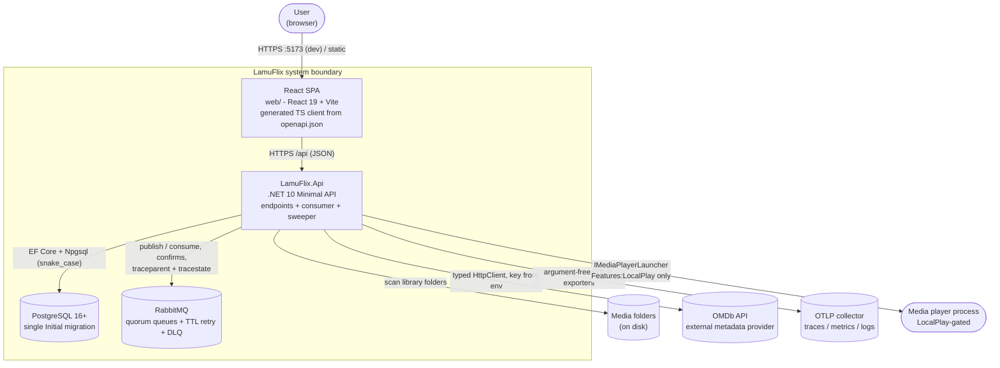

# C4 Container diagram

The legacy C# Web and Worker hosts are retired (ADR 0021). The only
host is `LamuFlix.Api`; enrichment runs as a consumer and a sweeper
hosted inside it (ADRs 0019, 0020).

```mermaid
flowchart TB
    user(["User<br/>(browser)"])
    fs[("Media folders<br/>(on disk)")]

    subgraph LamuFlix["LamuFlix system boundary"]
        spa["React SPA<br/>web/ - React 19 + Vite<br/>generated TS client from openapi.json"]
        api["LamuFlix.Api<br/>.NET 10 Minimal API<br/>endpoints + consumer + sweeper"]
        pg[("PostgreSQL 16+<br/>single Initial migration")]
        rmq[("RabbitMQ<br/>quorum queues + TTL retry + DLQ")]
    end

    omdb[("OMDb API<br/>external metadata provider")]
    otlp[("OTLP collector<br/>traces / metrics / logs")]
    player(["Media player process<br/>LocalPlay-gated"])

    user -->|"HTTPS :5173 (dev) / static"| spa
    spa -->|"HTTPS /api (JSON)"| api
    api -->|"EF Core + Npgsql (snake_case)"| pg
    api -->|"publish / consume, confirms,<br/>traceparent + tracestate"| rmq
    api -->|"typed HttpClient, key from env"| omdb
    api -->|"argument-free OTLP exporters"| otlp
    api -->|"IMediaPlayerLauncher<br/>Features:LocalPlay only"| player
    api -->|"scan library folders"| fs
```
